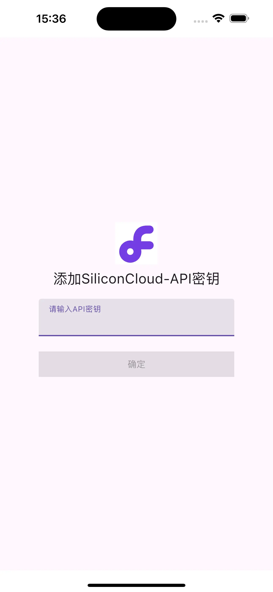
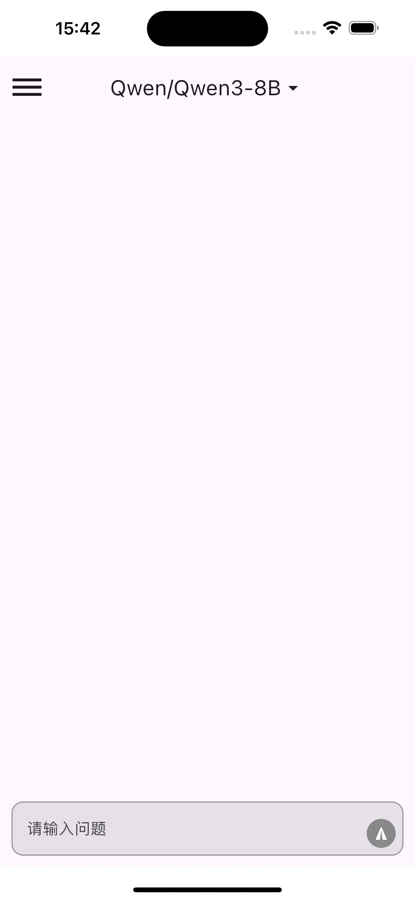
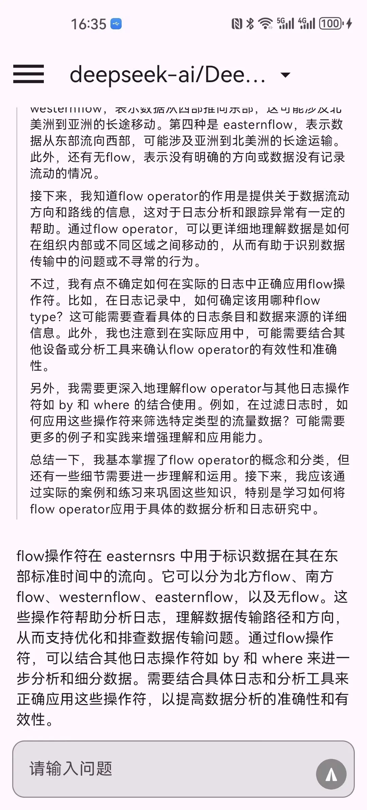
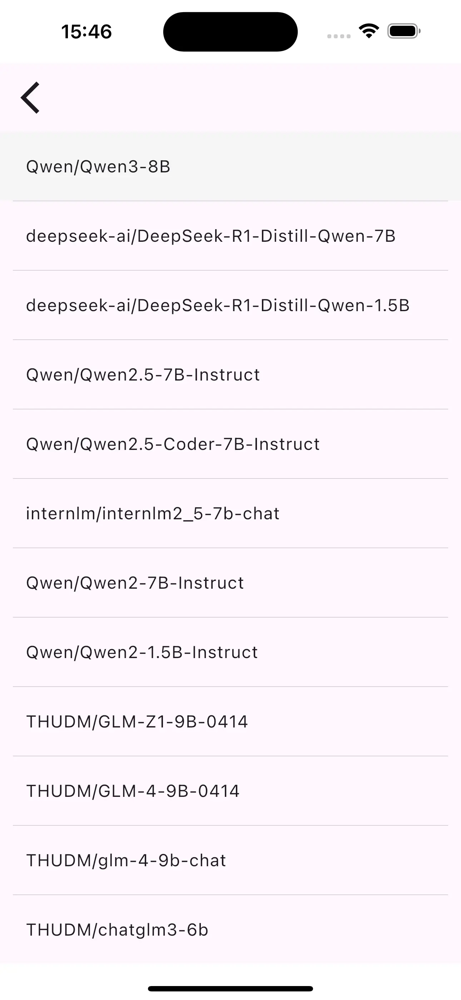
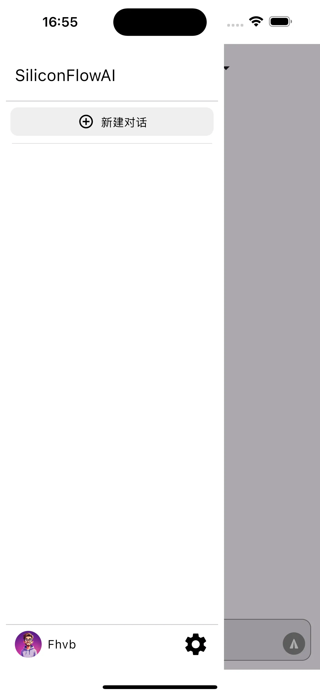

<h1 align="center">
  基于硅基流动（SiliconFlow）官方API开发的Kotlin Multiplatform项目
</h1>

### 介绍

本项目是一个Kotlin Multiplatform项目，同时使用了Compose Multiplatform，目前支持Android和iOS。
项目基于硅基流动（SiliconFlow）官方API开发，登录需要使用官方 APIKey。

[APIKey申请](https://cloud.siliconflow.cn/account/ak)

目前只支持文本对话模型，使用Server-Sent Events（SSE）请求流式输出，内置12个免费模型，如需使用其它收费模型，可以`/commonMain/composeResources/files/text_model.json`中自行添加编译。

数据全部存储在本地数据库中，可以根据需要自行删除。

### 主要库
* ComposeMultiplatform - UI
* navigation-compose - 页面导航
* Datastore-preferences - 数据存储
* Room - 数据库
* Koin - 依赖注入
* Ktor - 网络请求
* multiplatform-markdown-renderer - markdown显示文本

    